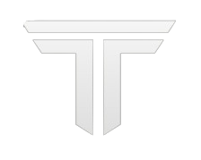

[![Contributors][contributors-shield]][contributors-url]
[![Forks][forks-shield]][forks-url]
[![Stargazers][stars-shield]][stars-url]
[![Issues][issues-shield]][issues-url]


<br />
<div align="center">
  <a href="https://github.com/othneildrew/Best-README-Template">
    
  </a>

  <h3 align="center">TeamsGG YSeries Synced Ringtones [emfan MOD]</h3>
    <br />
    <a href="https://www.yseries.live">YSeries Store</a>
    ·
    <a href="https://docs.teamsgg.com">TeamsGG Documentation</a>
    ·
    <a href="https://discord.com/invite/ae2TqAmEn7">TeamsGG Discord</a>
    .
    <a href="https://discord.gg/WycSqcDUt3">eMILSOMFAN Discord</a>
    <br />
    <br />
  <p align="center">
    Enhance your multiplayer experience with the <strong>[Synced Ringtones MOD]</strong> developed by <strong>eMILSOMFAN</strong>. This mod allows other players nearby to hear your phone's ringtone or vibration sounds when your phone rings or vibrates in-game, adding a realistic and immersive touch to your interactions.
  </p>
</div>

## Features

- **Realistic Notifications**: Let nearby players hear your phone's ringtone, notification or vibration sounds, making interactions more immersive.
- **Customizable Sounds**: Use default or your own custom ringtones for a personalized experience.

## Installation Instructions

1. **Merge Folders**: Merge the provided `yseries` folder with your existing `yseries` folder in your project directory.

## Custom Ringtones (Optional)


- **Using Custom Ringtones**:
  - Follow the naming convention: `<name>.mp3`
  - Place the `.mp3` files in the following directory:
    ```
    yseries/ui/build/yos/sounds/ringtones
    ```
  - Add the custom ringtone into config [YSeries Phone Documentation](https://docs.teamsgg.com/paid-scripts/phone/configure)
  

## Credits

  **Author and Developer of the script**: TeamsGG Development
  **Modded by**: eMILSOMFAN

---

Thank you for using this mod! Your feedback is appreciated.
If you have any questions or need assistance, feel free to join my Discord server: [Discord Link](https://discord.gg/WycSqcDUt3).


<!-- URL variables -->

[contributors-shield]: https://img.shields.io/github/contributors/eMILSOMFAN/yseries-synced-ringtones.svg?style=for-the-badge
[contributors-url]: https://github.com/eMILSOMFAN/yseries-synced-ringtones/graphs/contributors
[forks-shield]: https://img.shields.io/github/forks/eMILSOMFAN/yseries-synced-ringtones.svg?style=for-the-badge
[forks-url]: https://github.com/eMILSOMFAN/yseries-synced-ringtones/network/members
[stars-shield]: https://img.shields.io/github/stars/eMILSOMFAN/yseries-synced-ringtones.svg?style=for-the-badge
[stars-url]: https://github.com/eMILSOMFAN/yseries-synced-ringtones/stargazers
[issues-shield]: https://img.shields.io/github/issues/eMILSOMFAN/yseries-synced-ringtones.svg?style=for-the-badge
[issues-url]: https://github.com/eMILSOMFAN/yseries-synced-ringtones/issues